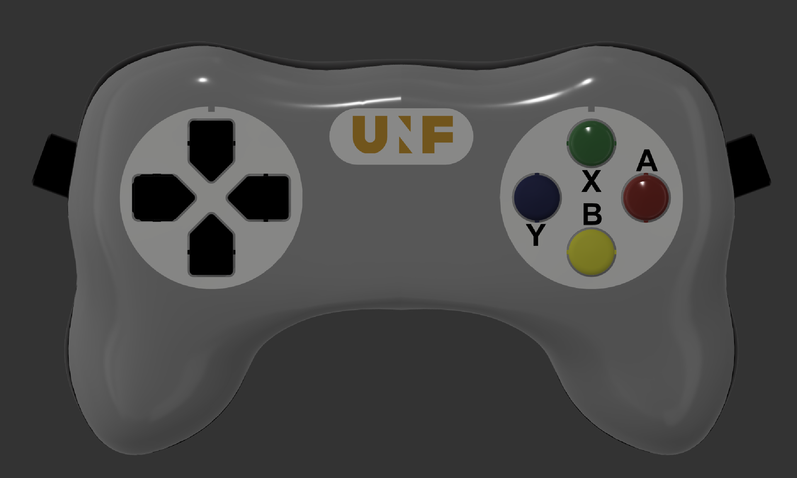

# About
This document describes how to build the MR compatible videogame controller developed for the [Courtois Neuromod project](https://www.cneuromod.ca).

 
3D model of the controller design.

/!\ To add : overview schema of the different controller parts (i.e. body, fibers, PCB, stim computer)

## Documentation

- [Controller body assembly](https://github.com/courtois-neuromod/engineering_doc/blob/master/game_controller/controller_body/readme.md)
- [PCB electronics board](https://github.com/courtois-neuromod/engineering_doc/blob/master/game_controller/PCB/readme.md)
- [Software](https://github.com/courtois-neuromod/engineering_doc/tree/master/game_controller/teensy/source/readme.md)
