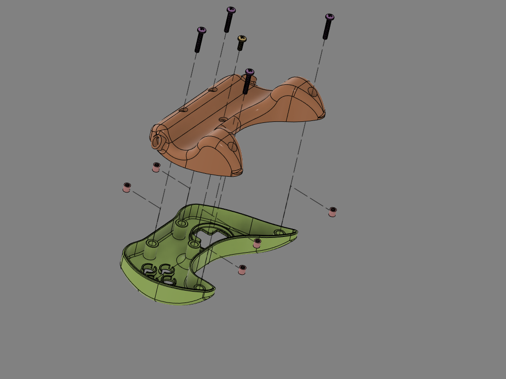
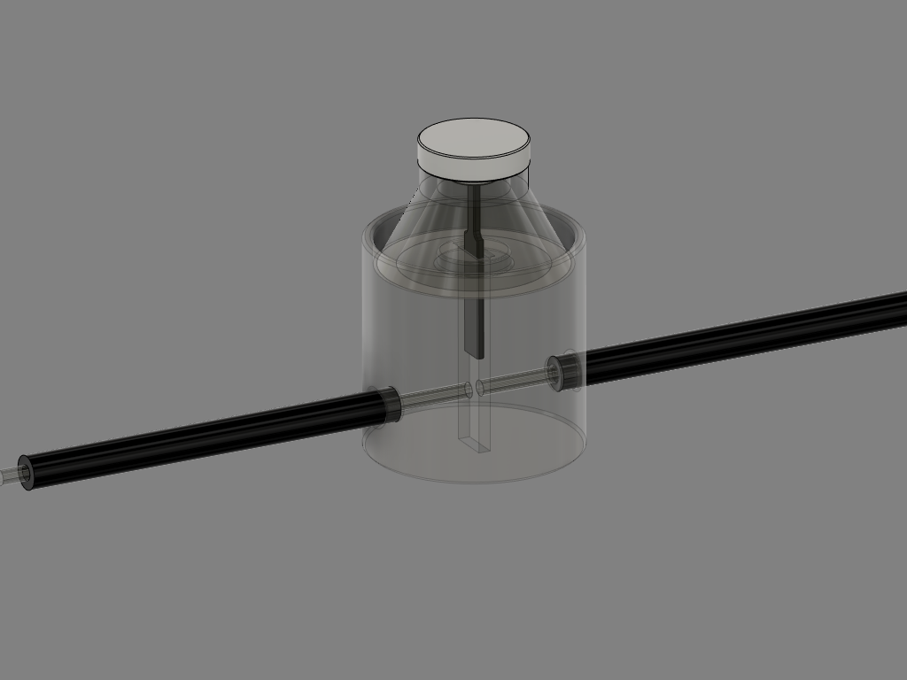
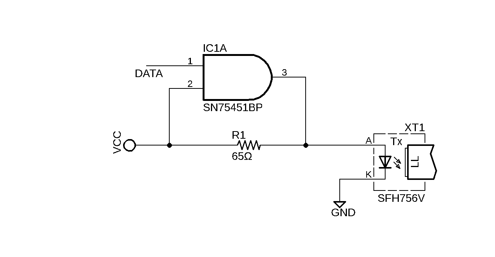
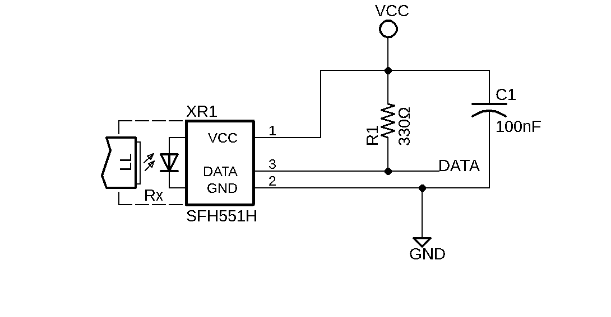

# Intro

# Design considerations

## MR/MEG compatibility

## Performance

# Description

## Mechanical

### Enclosure
The enclosure for the controller is the part that will be held by the participant inside the MR scanner. It has to be free of any metallic/electronic part. It was designed using Autodesk Fusion 360, basing the model on the general shape of different commercially available controllers. All parts were 3D printed using an Ultimaker 3 printer with PLA filament.  
The top and bottom parts of the casing are held together with commercially available Nylon 6/6 threaded inserts and polycarbonate screws.

 
**_Casing assembly_**

### Switch mechanism
The sensing mechanism for all controls is made of 2 optical fibers of 10 m length going from the electronics interface in the scanner control room to the enclosure inside the scanner and back. Inside the enclosure, the transmitting and receiving fibers are aligned by insertion in a switch module and positioned facing each other leaving a 0.8 mm air gap. When a button is pressed, a small shutter blade moves down to block the light going through and the optical receiver module located in the control room triggers a digital input on the microcontroller.

 
**_Optical switch_**

## Electronics

### Fiber emitter

### Fiber receiver

## Programming

# Construction

Suppliers used:  
- Digikey Electronics [www.digikey.com](www.digikey.com)  
- McMaster-Carr [www.mcmaster.com](www.mcmaster.com)

Part | Manufacturer | Supplier | Manufacturer part no. | Supplier part no. | Qty
-----|--------------|----------|-----------------------|------------------|-|
Fiber optic cable | Broadcom Limited | Digikey | HFBR-RUD500Z | 516-2094-ND | 1
Fiber optic transmitter | Broadcom Limited | Digikey | SP000063814 | 516-2213-ND | 10
Fiber optic receiver | Broadcom Limited | Digikey | SP000063855 | 516-2455-ND | 10
Teensy 3.5 microcontroller board | SparkFun Electronics | Digikey |DEV-14055 |1568-1443-ND | 1
Gate driver | Texas Instruments | Digikey | SN75451BP | 	296-1746-5-ND | 5
Hose 13mm ID, black PE|Panduit Corp|Digikey|CLTS50F-C|298-13576-ND | 1
Hose 19.48mm ID, black PE|Panduit Corp|Digikey|CLTS75F-C|	298-13577-ND | 1
Resistor 330 Ω | | Digikey | | 	A131459CT-ND | 10
Polycarbonate Pan Head Philips Screw 8-32 x 1" | | McMaster-Carr| |93140A782 | 2
Polycarbonate Pan Head Philips Screw 8-32 x 1/2" | | McMaster-Carr | |93140A588 | 3
Nylon 6/6 Female Threaded Round Standoff 8-32 x 1/4"| | McMaster-Carr| |96110A026 | 5

Other:
- Silicone membrane from discarded computer keyboard

# Mechanical

## Required
- CAD Software
- Slicing software
- Access to 3D printer

### CAD
All parts were designed using Autodesk Fusion 360.

## 3D printing parts
All 3D printed parts were printed on a Ultimaker 3 printer (Ultimaker) using PLA or ABS plastic.

Part | Qty needed | Material 1 | Material 2 | Nozzle 1 size | Nozzle 2 size | Layer height | Print direction
----|------------|------------|---------------|---------------|--------------|---------------|--|
Casing_Top | 1 | PLA | PVA | 0.4 mm | 0.4 mm | 0.2 mm | +Y
Casing_Bottom | 1 | PLA | PVA | 0.4 mm | 0.4 mm | 0.2 mm | -Y
Switch_Body | 8 |PLA | - | 0.25 mm | - | 0.1 mm | +Y
Shutter_Blade | 8 |PLA | - | 0.25 mm | - | 0.06 mm | +Z
Shutter_Cap | 8 | PLA | - | 0.25 mm | - | 0.06 mm | -Y
Button_Cap | 4 | PLA | PVA | 0.25 mm | 0.4 mm | 0.1 mm | +Y
DPad_Support | 1 | PLA | PVA | 0.4 mm | 0.4 mm | 0.1 mm | +Y
DPad_Cross | 1 | PLA | PVA | 0.4 mm | 0.4 mm | 0.1 mm | +Y

Main 3D printing parameters

## Silicone membranes
Use sharp Xacto knife to cut free the silicone dome used to push the keys upward after a keystroke. Carefully cut away the center of the top part to leave hole for shutter.

## Assembly

### Interface enclosure

# Electronics

## Obtaining interface printed circuit board

List of gerber files needed

## Assembling circuit

# Software
