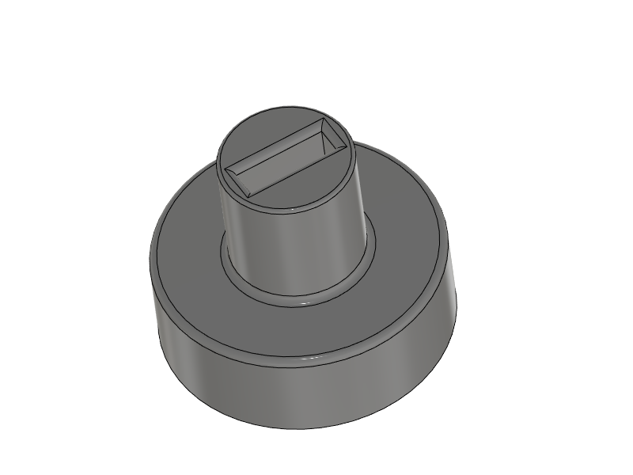

This file details the list of 3D printed parts required to build the controller and gives information about the main printing parameters used. All parts were printed using an Ultimaker 3 [http://ultimaker.com](http://ultimaker.com) printer. The print direction given was set as the positive Z direction in the printer. So if the direction **+Y** is given, the positive Y direction from the .stl file was set as positive Z in the slicing software.

Parts usually require a small amount of post finishing. A kit of fine grit files like https://www.mcmaster.com/8174A42/ is very useful for that purpose.

## List of files

1. [Casing_Top](CAD/stl/Top.zip)
2. [Casing_Bottom](CAD/stl/Bottom.zip)
3. [Switch_Body](CAD/stl/Switch_Body.zip)
4. [Shutter_Cap](CAD/stl/Shutter_cap.zip)
5. [Shutter_Blade](CAD/stl/Shutter_Blade.zip)
6. [DPad_Support](CAD/stl/DPad_Support.zip)
7. [Button_Cap](CAD/stl/Button_Cap.zip)
8. [Dir_Button](CAD/stl/Dir_Button.zip)
9. Y_Splitter
10. [Interface_Casing_Top](CAD/stl/Interface_Top.zip)
11. [Interface_Casing_Bottom](CAD/stl/Interface_Bottom.zip)
12. Fiber_Cutting_Block
13. Fiber_Polishing_Tool

## Casing_Top
Casing_Top.stl | 
------|--------
Weight|53.8 g
Volume|46.4 cm3
Bounding box | 155.4 x 43.5 x 94.9 mm
Qty | 1
Material 1 | PLA
Material 2 (support) | PVA
Material 1 density | 100%
Material 2 density | 40%
Nozzle 1 size | 0.8 mm
Nozzle 2 size | 0.4 mm
Nozzle 1 temperature | 205 °C
Nozzle 2 temperature | 230 °C
Bed temperature | 50 °C
Layer height | 0.15 mm
Print direction | +Y
Comments

## Casing_Bottom
Casing_Bottom.stl | 
------|--------
Weight|107.9 g
Volume|87.0 cm3
Bounding box | 169.8 x 58.8 x 95.1 mm
Qty | 1
Material 1 | PLA
Material 2 (support) | PVA
Material 1 density | 100%
Material 2 density | 40%
Nozzle 1 size | 0.8 mm
Nozzle 2 size | 0.4 mm
Nozzle 1 temperature | 205 °C
Nozzle 2 temperature | 230 °C
Bed temperature | 50 °C
Layer height | 0.15 mm
Print direction | -Y
Comments

## Switch_Body
Switch_Body.stl | 
------|--------
Weight|3.6 g
Volume|2.9 cm3
Bounding box | 16.0 x 18.5  x 16.0 mm
Qty | 8
Material 1 | PLA
Material 2 (support) | same as material 1
Material 1 density | 100%
Material 2 density | 40%
Nozzle 1 size | 0.25 mm
Nozzle 2 size | N/A
Nozzle 1 temperature | 205 °C
Nozzle 2 temperature | N/A
Bed temperature | 50 °C
Layer height | 0.1 mm
Print direction | +Y
Comments|

## Shutter_Cap
Shutter_Cap.stl | 
------|--------
Weight|0.19 g
Volume|0.15 cm3
Bounding box | 7.5 x 6.3  x 7.5 mm
Qty | 8
Material 1 | PLA
Material 2 (support) | -
Material 1 density | 100%
Material 2 density | -
Nozzle 1 size | 0.25 mm
Nozzle 2 size | -
Nozzle 1 temperature | 205 °C
Nozzle 2 temperature | -
Bed temperature | 50 °C
Layer height | 0.1 mm
Print direction | -Y
Comments|

## Shutter_Blade
Shutter_Blade.stl | 
------|--------
Weight|0.014 g
Volume|0.0012 cm3
Bounding box | 0.5 x 11.7 x 2.2 mm
Qty | 8
Material 1 | PLA
Material 2 (support) | -
Material 1 density | 100%
Material 2 density | -
Nozzle 1 size | 0.25 mm
Nozzle 2 size | -
Nozzle 1 temperature | 205 °C
Nozzle 2 temperature | -
Bed temperature | 50 °C
Layer height | 0.06 mm
Print direction | +X
Comments | This works better if printed with dark (ideally black) material

## DPad_Support
DPad_Support.stl | 
------|--------
Weight|14.6 g
Volume|11.8 cm3
Bounding box | 46.9 x 13.2  x 48.5 mm
Qty | 1
Material 1 | PLA
Material 2 (support) | PVA
Material 1 density | 100%
Material 2 density | 30%
Nozzle 1 size | 0.4 mm
Nozzle 2 size | 0.4 mm
Nozzle 1 temperature | 205 °C
Nozzle 2 temperature | 230 °C
Bed temperature | 50 °C
Layer height | 0.1 mm
Print direction | +Y
Comments | Some post finishing of guiding slots may be required to get smooth button motion. Use of fine grit small detailing files or sanding paper recommended. This part can be printed at lower than 100% density, but make sure that walls are thick enough. Cura's default with 0.4 mm nozzle is 1 mm, at least double that.
