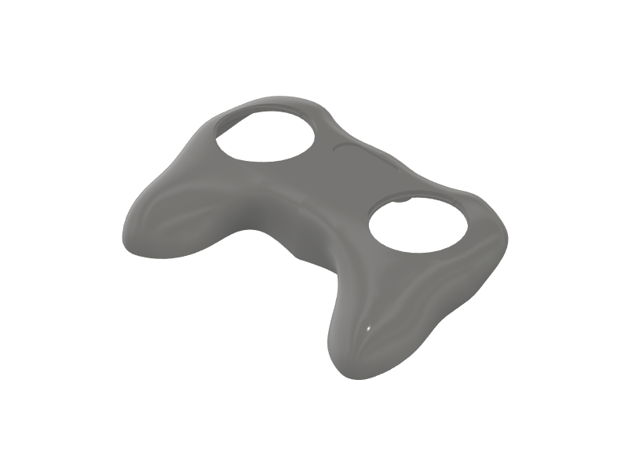

This file details the list of 3D printed parts required to build the controller and gives information about the main printing parameters used. All parts were printed using an Ultimaker 3 [http://ultimaker.com](http://ultimaker.com) printer. The print direction given was set as the positive Z direction in the printer. So if the direction **+Y** is given, the positive Y direction from the .stl file was set as positive Z in the slicing software.

## List of files

1. [Casing_Top](CAD/stl/Top.zip)
2. [Casing_Bottom](CAD/stl/Bottom.zip)
3. [Switch_Body](CAD/stl/Switch_Body.zip)
4. [Shutter_Blade](CAD/stl/Shutter_Blade.zip)
5. [Shutter_Cap](CAD/stl/Shutter_cap.zip)
6. [Button_Cap](CAD/stl/Button_Cap.zip)
7. [DPad_Support](CAD/stl/DPad_Support.zip)
8. [Dir_Button](CAD/stl/Dir_Button.zip)
9. Y_Splitter
10. [Interface_Casing_Top](CAD/stl/Interface_Top.zip)
11. [Interface_Casing_Bottom](CAD/stl/Interface_Bottom.zip)
12. Fiber_Cutting_Block
13. Fiber_Polishing_Tool

## Casing_Top
Casing_Top.stl | 
------|--------
Weight|53.8 g
Volume|46.4 cm3
Bounding box | 155.4 x 43.5 x 94.9 mm
Qty | 1
Material 1 | PLA
Material 2 (support) | PVA
Material 1 density | 100%
Material 2 density | 40%
Nozzle 1 size | 0.8 mm
Nozzle 2 size | 0.4 mm
Nozzle 1 temperature | 205 °C
Nozzle 2 temperature | 230 °C
Bed temperature | 50 °C
Layer height | 0.15 mm
Print direction | +Y
Comments

## Casing_Bottom
Casing_Bottom.stl | 
------|--------
Weight|107.9 g
Volume|87.0 cm3
Bounding box | 169.8 x 58.8 x 95.1 mm
Qty | 1
Material 1 | PLA
Material 2 (support) | PVA
Material 1 density | 100%
Material 2 density | 40%
Nozzle 1 size | 0.8 mm
Nozzle 2 size | 0.4 mm
Nozzle 1 temperature | 205 °C
Nozzle 2 temperature | 230 °C
Bed temperature | 50 °C
Layer height | 0.15 mm
Print direction | -Y
Comments
