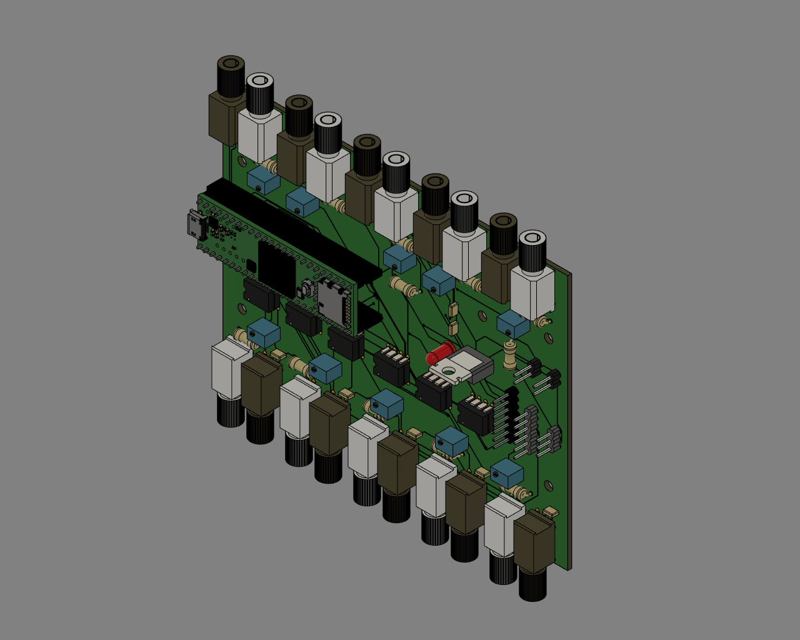
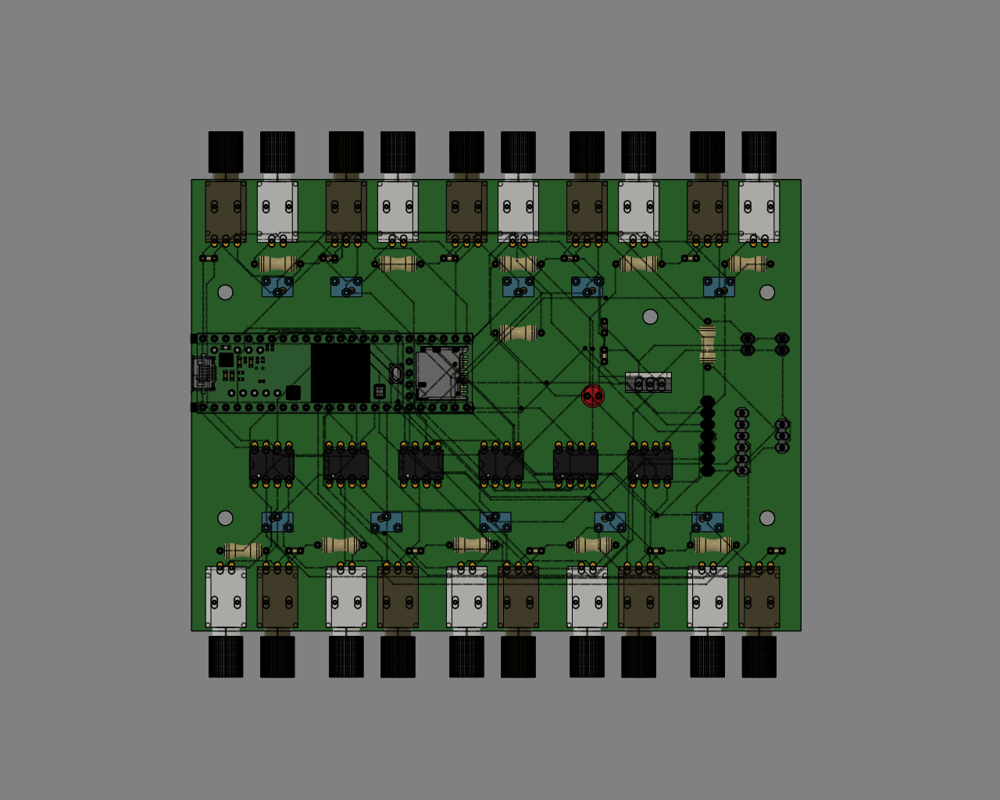
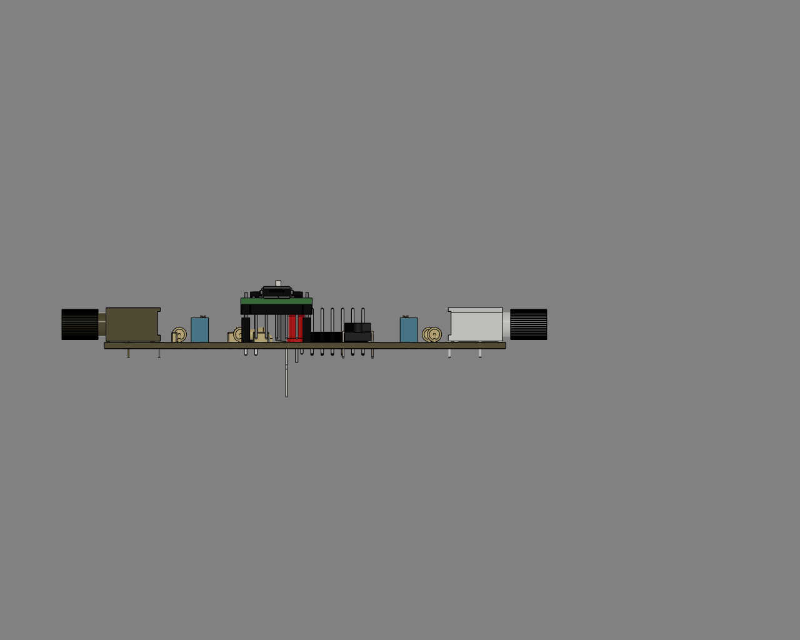
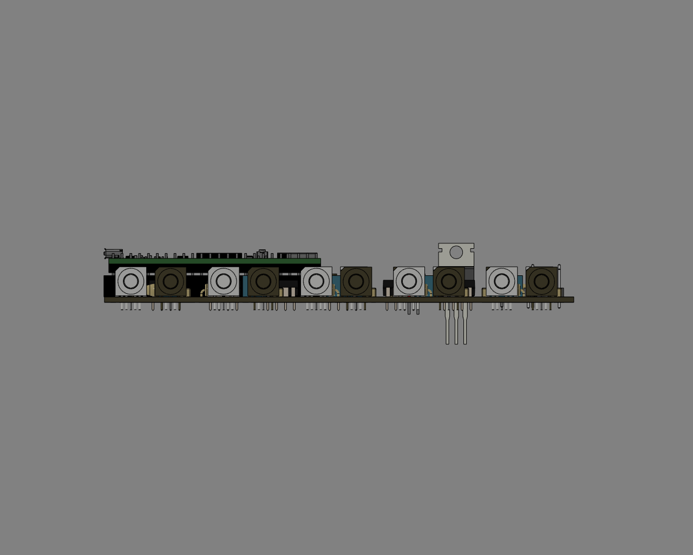
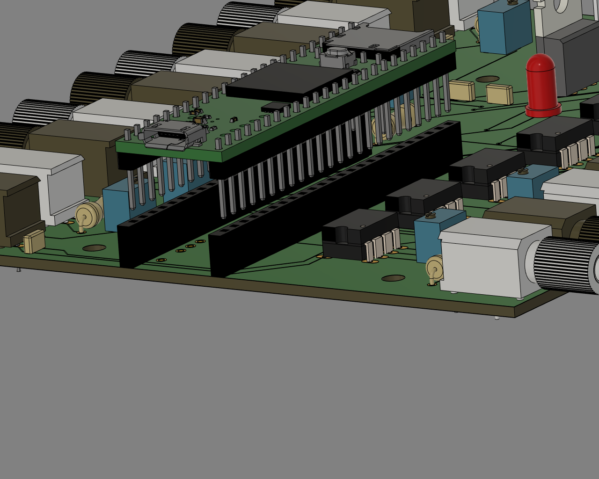

# PCB assembly instructions

## Ordering PCBs

Get Gerber files and send to fab house

## Assembly

 
PCB isometric view

 
PCB Top view

 
PCB Side view

 
PCB Side view

Tensy with headers | Teensy on PCB
---|---
 |

Schematics | Component| Value
-----------|----------|---|
IC1 - IC5, IC7|Gate driver|SN75451BP
IC6|Voltage regulator|LM340
R1 - R8|Resistor| 65 Ω
R11 - R18|Resistor|330 Ω between pin 1 & 2
R21|Resistor| 5 kΩ
C1 - C8|Capacitor|0.1 µF
C11,C12|Capacitor|10 µF
TX1 - TX8|Fiber optic transmitter|SP000063814
RX1 - RX8|Fiber optic receiver|SP000063855
Teensy 3.5 | Use version 3.5 **NOT 3.6**
