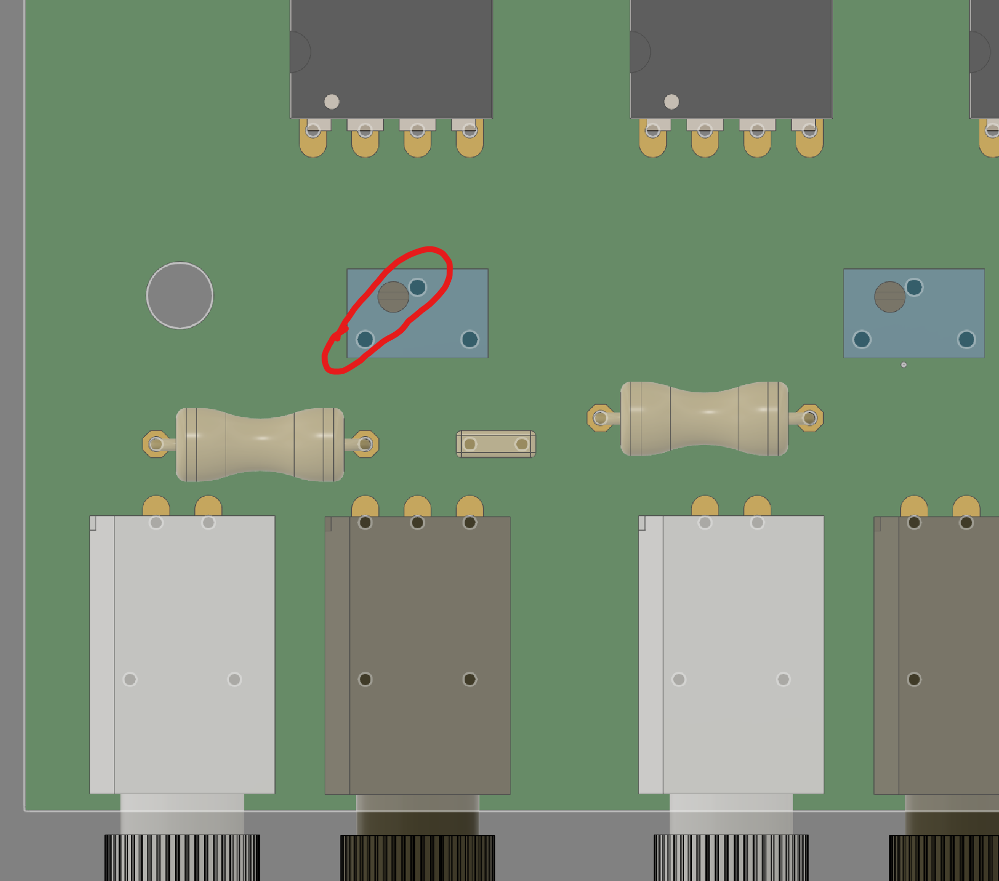

# PCB assembly instructions
Get PCB 3D model [here](../CAD/stp/neuromod_game_controller_v1.zip)

## Ordering PCBs

Get Gerber files [here](GerberFiles.zip) and send to fab house

## Assembly

 
PCB isometric view

 
PCB Top view

 
PCB Side view

 
PCB Side view

Tensy with headers | Teensy on PCB
---|---
 |

The Teensy board can be mounted either on headers (left) or directly on PCB (right). The first option is recommended as is allows easy replacement in case of damage.

 
Adjust potentiometer to be 330 Ω between the two illustrated pins or solder directly a 330 Ω resistor between those pins.

 
Board layout

Schematics | Component| Value
-----------|----------|---|
IC1 - IC5, IC7|Gate driver|SN75451BP
IC6|Voltage regulator|LM340
R1 - R10|Resistor| 65 Ω
R11 - R29|Resistor|330 Ω between pin 1 & 3
R21|Resistor| 5 kΩ
C1 - C8|Capacitor|0.1 µF
C11,C12|Capacitor|10 µF
TX1 - TX8|Fiber optic transmitter|SFH756V
RX1 - RX8|Fiber optic receiver|SFH551V
Teensy 3.5 | Use version 3.5 **NOT 3.6**
