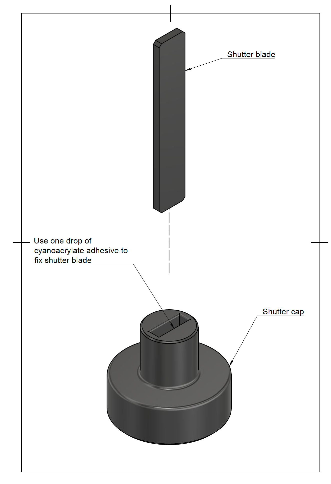
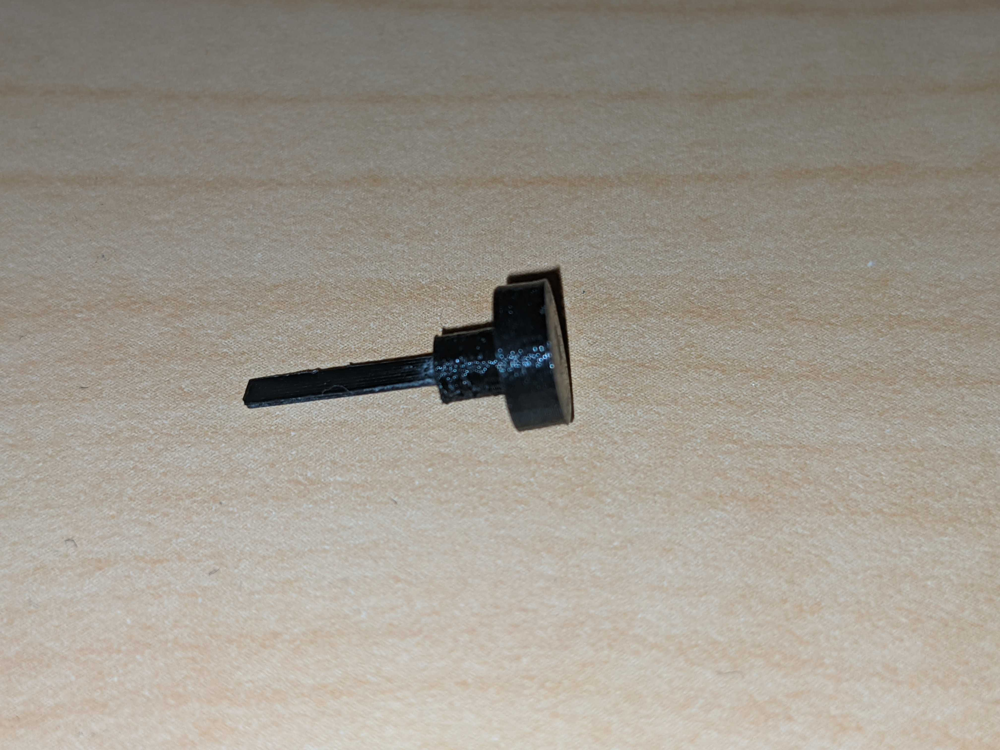
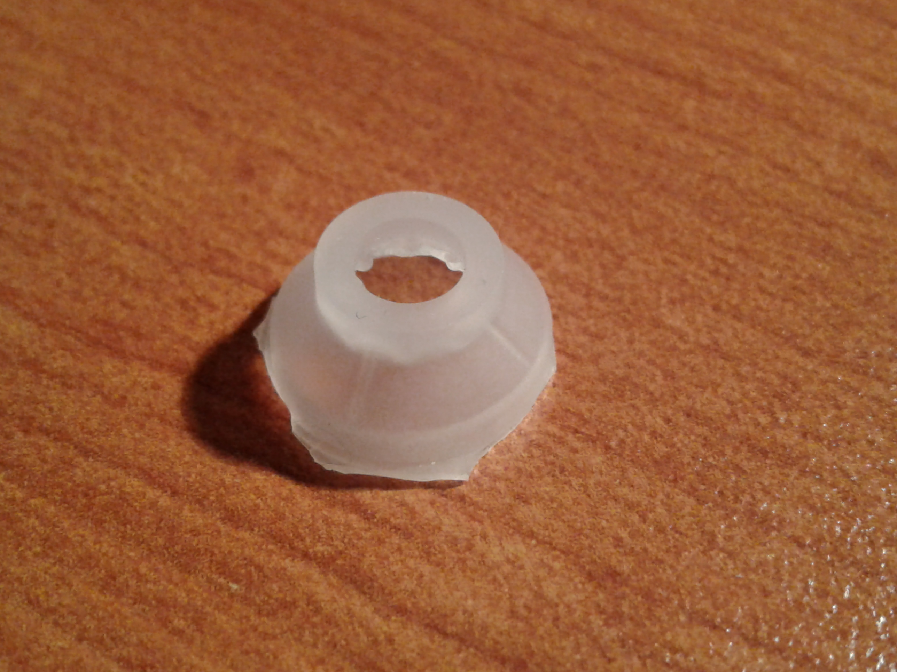
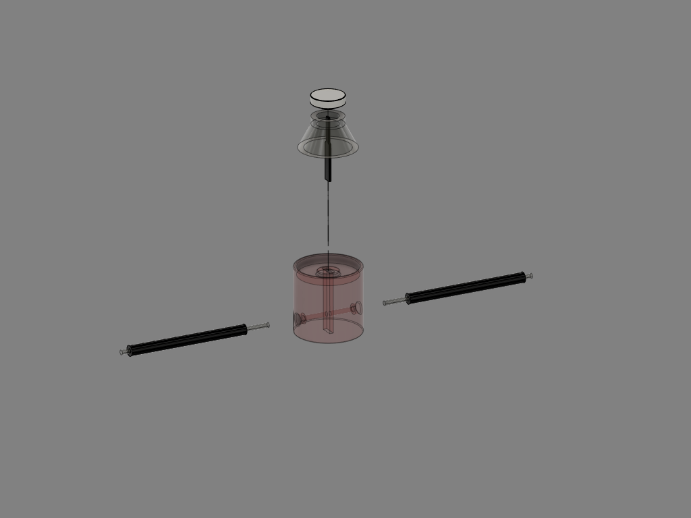
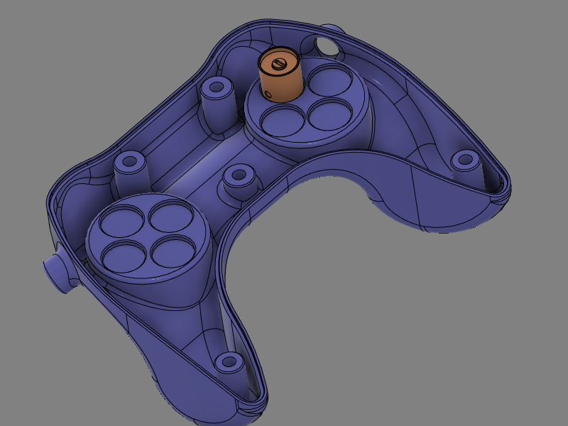
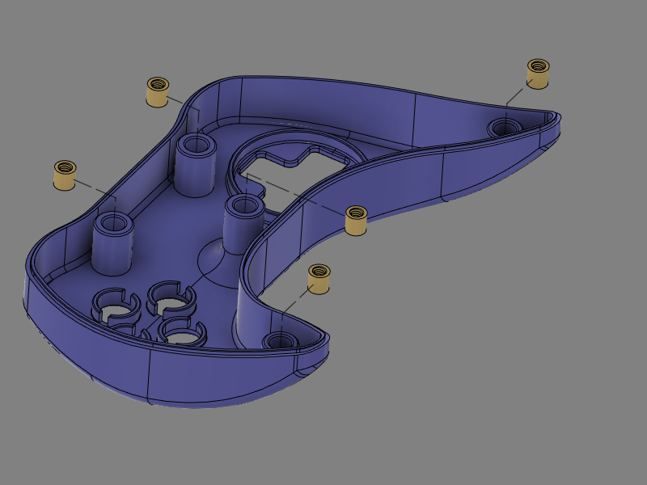

# About
This document describes how to build the MR compatible videogame controller developed for the [Courtois Neuromod project](https://www.cneuromod.ca).

# Getting the parts
Aside from the 3D printed equipment and printed circuit boards, the parts required to build the controller can be obtained from two suppliers; [McMaster-Carr](http://mcmaster.com) and [Digikey](http://digikey.com). It is most likely possible to find other sources for the components, but the part numbers given here are for these two suppliers. The manufacturers names and part numbers are also given when available. The numbers given represent the bare minimum required to build the controller. Getting spares of everything is highly recommended.

## COTS
This section details the parts that need to be purchased directly from a supplier.
[BOM.md](BOM.md)

## 3D printed parts
This section list the parts that needs to be 3D printed.
List of CAD files needed
1. [Casing_Top](CAD/stl/Top.zip)
2. [Casing_Bottom](CAD/stl/Bottom.zip)
3. [Switch_Body](CAD/stl/Switch_Body.zip)
4. [Shutter_Blade](CAD/stl/Shutter_Blade.zip)
5. [Shutter_Cap](CAD/stl/Shutter_cap.zip)
6. [Button_Cap](CAD/stl/Button_Cap.zip)
7. [DPad_Support](CAD/stl/DPad_Support.zip)
8. [Dir_Button](CAD/stl/Dir_Button.zip)
9. Y_Splitter
10. [Interface_Casing_Top](CAD/stl/Interface_Top.zip)
11. [Interface_Casing_Bottom](CAD/stl/Interface_Bottom.zip)
12. Fiber_Cutting_Block
13. Fiber_Polishing_Tool

# Assembly

## Controller

### Optical switches

#### Shutter assembly

Check both shutter blade and shutter cap for smoothness of surface and file or sand any rough surface. Test insertion of blade into slot at the bottom of shutter cap. It should slide to the bottom easily but you should still feel a bit of resistance. Put a drop of cyanoacrylate adhesive on a liquid tight surface, dip the end of shutter blade in adhesive and insert into slot at bottom of shutter cap.

Shutter assembly drawing | Shutter assembly exemple
---|---
 |

Ensure that the air gap and the fiber optic guide in the 3D printed switch bodies are free of any residual PLA or support material. Hold switch body in front of a light source and check along Z axis for the air gap, and along horizontal axis for the fiber optic guide.

### Controller body

1. For each control on the controller, cut one length of duplex fiber optic to desired length between controller and interface module + 150 mm
2. Split each length of fiber on its length to separate the 2 fibers on a distance of approx. 750 mm from one end, and 25 mm from second end
3. Label each fiber with the name of matching control. On the end where the fibers are split for the largest distance (controller end) place a label on each single fiber
4. On the controller side of the fibers, make two bundles of fibers. Place one fiber of each control in either bundle.
5. For one of the two bundles, cut the fibers for the directional pad controls about 150 mm shorter than the ones for the buttons. Do the opposite with the other bundle. This will allow a cleaner layout of the fibers inside the casing.
6. Strip and polish fibers **(need procedure)**
7. Cut two 500 mm lengths of the 13 mm ID plastic hose and fix those on the ends of the Y splitter
8. Fix second end of plastic hoses to extrusions on part *Casing_Bottom*

Fiber_Sheath_Assembly

9. For each control, place a *Switch_Body* in matching groove inside casing.

10. Insert the fiber optics into Y splitter and push gently until both fibers emerge inside of casing. The bundle where the buttons fibers are longer will go on the directional pad side. There will be one fiber for each control in each branch of the Y. Make sure that the length protruding inside the casing is enough to reach into the corresponding *Switch_Module* and allow to lay out cleanly inside casing.
11. For each control, glue both fibers in place **(Need glue specs)**
12. Optional: Depending on fit tightness of *Switch_Module* parts inside grooves, it is also possible to glue the module in place. If gluing modules in place, wait for glue on fibers to set before proceeding
13. Place one threaded Nylon insert in each mounting post of part *Casing_Top*. If inserts don't fit inside, re-drill hole using 1/4" (6.35 mm) bit. If inserts are loose, use a drop of cyanoacrylate adhesive

