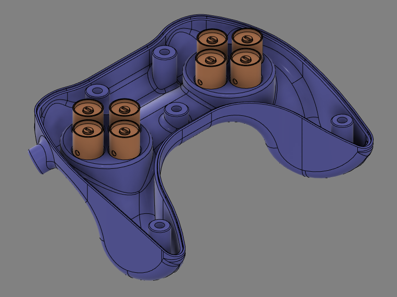

# Intro
# Required

Part | Manufacturer | Supplier | Manufacturer part no. | Supplier part no. | Qty
-----|--------------|----------|-----------------------|------------------|-|
Fiber optic cable | Broadcom Limited | Digikey | HFBR-RUD500Z | 516-2094-ND | 1
Fiber optic transmitter | Broadcom Limited | Digikey | SP000063814 | 516-2213-ND | 10
Fiber optic receiver | Broadcom Limited | Digikey | SP000063855 | 516-2455-ND | 10
Teensy 3.5 microcontroller board | SparkFun Electronics | Digikey |DEV-14055 |1568-1443-ND | 1
Gate driver | Texas Instruments | Digikey | SN75451BP | 	296-1746-5-ND | 5
Hose 13mm ID, black PE|Panduit Corp|Digikey|CLTS50F-C|298-13576-ND | 1
Hose 19.48mm ID, black PE|Panduit Corp|Digikey|CLTS75F-C|	298-13577-ND | 1
Polycarbonate Pan Head Philips Screw 8-32 x 1" | | McMaster-Carr||93140A782 | 2
Polycarbonate Pan Head Philips Screw 8-32 x 1/2" | | McMaster-Carr||93140A588 | 3
Nylon 6/6 Female Threaded Round Standoff 8-32 x 1/4"||McMaster-Carr||96110A026 | 5

Other:
- Silicone membrane from discarded computer keyboard

# Mechanical

## Required
- CAD Software
- Slicing software
- Access to 3D printer

List of CAD files needed
1. [Casing_Top](stl/Top_v33.zip)
2. [Casing_Bottom](stl/Bottom_v31.zip)
3. Switch_Body
4. Shutter_Blade
5. Shutter_Cap
6. Button_Cap
7. DPad_Support
8. DPad_Cross
9. Y_Splitter
10. Interface_Casing_Top
11. Interface_Casing_Bottom
12. Fiber_Cutting_Block
13. Fiber_Polishing_Tool

## 3D printing parts
All 3D printed parts were printed on a Ultimaker 3 printer (Ultimaker) using PLA or ABS plastic.

Part | Qty needed | Material 1 | Material 2 | Nozzle 1 size | Nozzle 2 size | Layer height | Print direction
----|------------|------------|---------------|---------------|--------------|---------------|--|
Casing_Top | 1 | PLA | PVA | 0.4 mm | 0.4 mm | 0.2 mm | +Y
Casing_Bottom | 1 | PLA | PVA | 0.4 mm | 0.4 mm | 0.2 mm | -Y
Switch_Body | 8 |PLA | - | 0.25 mm | - | 0.1 mm | +Y
Shutter_Blade | 8 |PLA | - | 0.25 mm | - | 0.06 mm | +Z
Shutter_Cap | 8 | PLA | - | 0.25 mm | - | 0.06 mm | -Y
Button_Cap | 4 | PLA | PVA | 0.25 mm | 0.4 mm | 0.1 mm | +Y
DPad_Support | 1 | PLA | PVA | 0.4 mm | 0.4 mm | 0.1 mm | +Y
DPad_Cross | 1 | PLA | PVA | 0.4 mm | 0.4 mm | 0.1 mm | +Y

Main 3D printing parameters

## Silicone membranes
Use sharp Xacto knife to cut free the silicone dome used to push the keys upward after a keystroke. Carefully cut away the center of the top part to leave hole for shutter.

## Assembly

### Controller
1. For each control on the controller, cut one length of duplex fiber optic to desired length between controller and interface module + 150 mm
2. Split each length of fiber on its length to separate the 2 fibers on a distance of approx. 750 mm from one end, and 25 mm from second end
3. Label each fiber with the name of matching control. On the end where the fibers are split for the largest distance (controller end) place a label on each single fiber
4. On the controller side of the fibers, make two bundles of fibers. Place one fiber of each control in either bundle.
5. For one of the two bundles, cut the fibers for the directional pad controls about 150 mm shorter than the ones for the buttons. Do the opposite with the other bundle. This will allow a cleaner layout of the fibers inside the casing.
6. Strip and polish fibers **(need procedure)**
7. Cut two 500 mm lengths of the 13 mm ID plastic hose and fix those on the ends of the Y splitter
8. Fix second end of plastic hoses to extrusions on part *Casing_Bottom*

Fiber_Sheath_Assembly

9. For each control, place a *Switch_Body* in matching groove inside casing.

10. Insert the fiber optics into Y splitter and push gently until both fibers emerge inside of casing. The bundle where the buttons fibers are longer will go on the directional pad side. There will be one fiber for each control in each branch of the Y. Make sure that the length protruding inside the casing is enough to reach into the corresponding *Switch_Module* and allow to lay out cleanly inside casing.
11. For each control, glue both fibers in place **(Need glue specs)**
12. Optional: Depending on fit tightness of *Switch_Module* parts inside grooves, it is also possible to glue the module in place. If gluing modules in place, wait for glue on fibers to set before proceeding
13. Place one threaded Nylon insert in each mounting post of part *Casing_Top*. If inserts don't fit inside, re-drill hole using 1/4" (6.35 mm) bit. If inserts are loose, use a drop of cyanoacrylate adhesive

  

### Interface enclosure

# Electronics

## Obtaining interface printed circuit board

List of gerber files needed

## Assembling circuit

# Software
