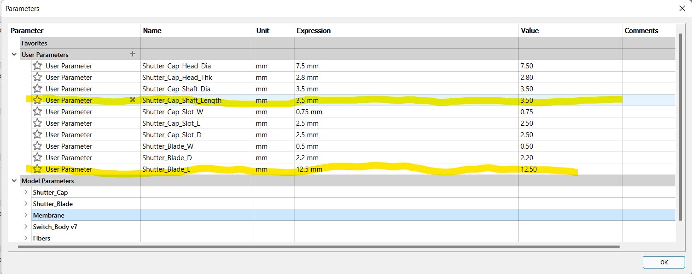
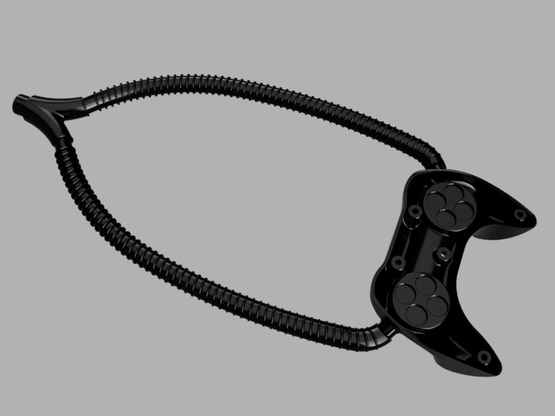
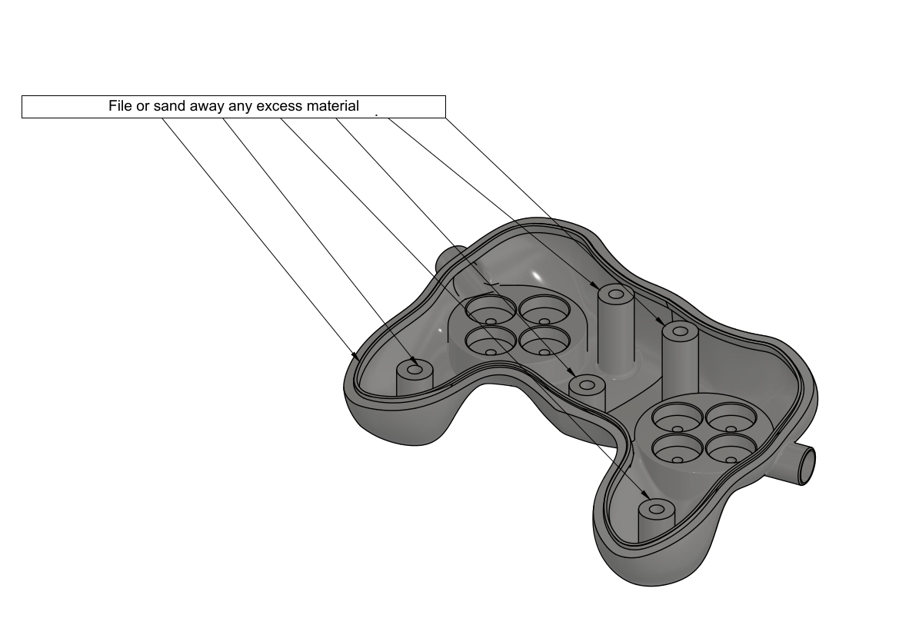
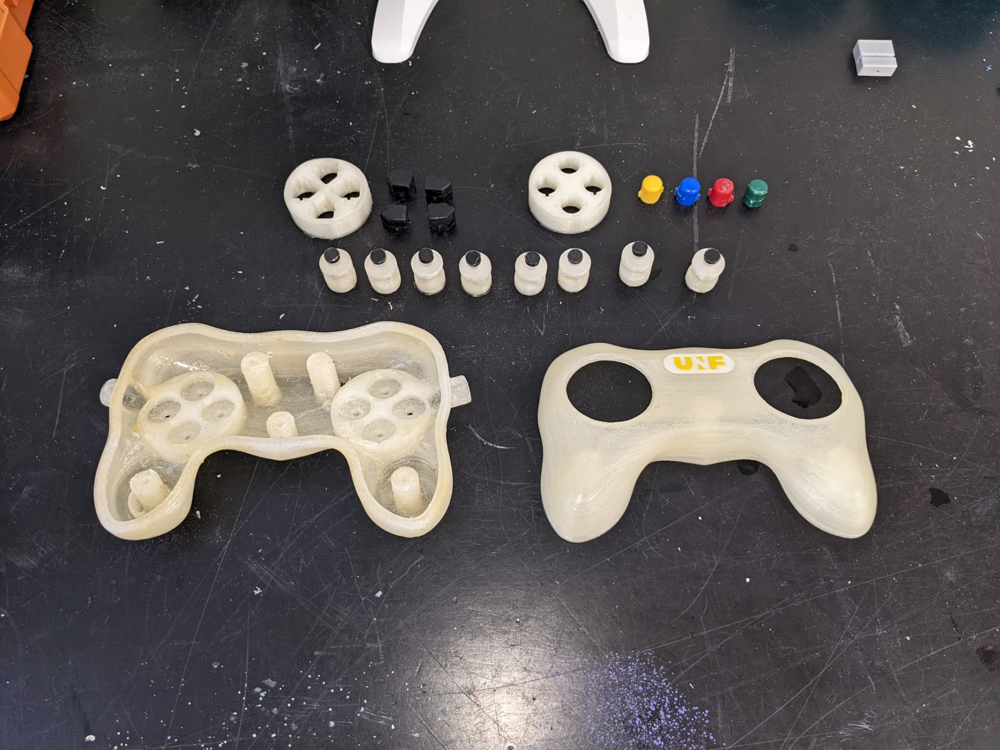
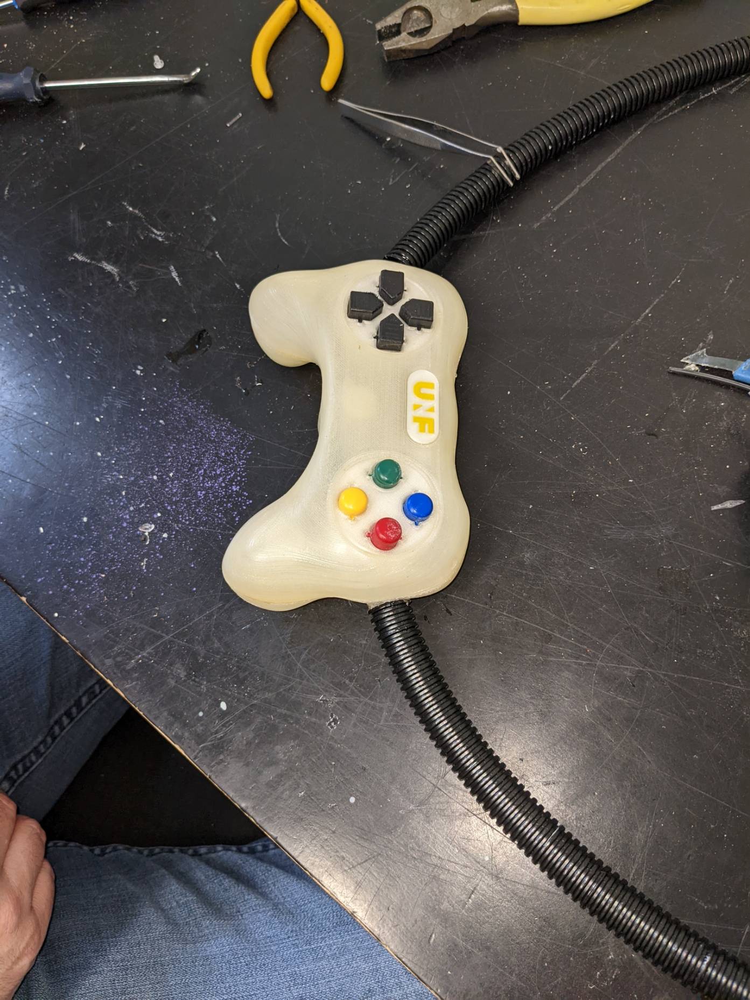
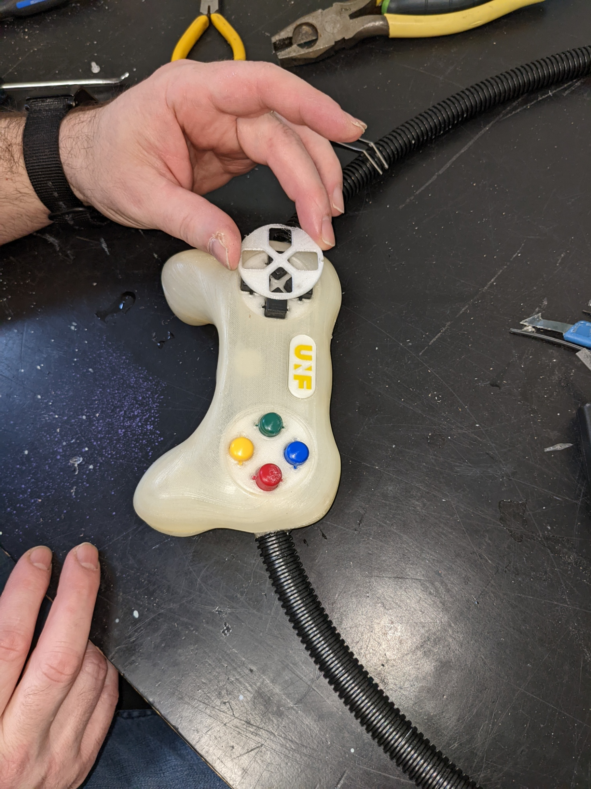
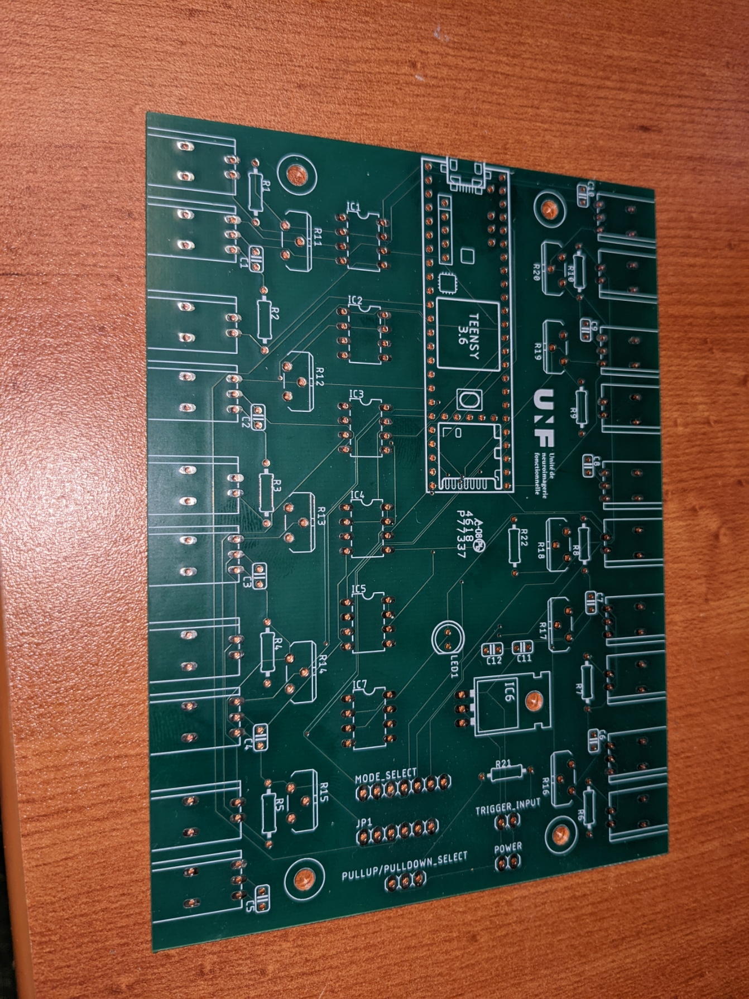

# About
This document describes how to build the MR compatible videogame controller developed for the [Courtois Neuromod project](https://www.cneuromod.ca).

# Getting the parts
Aside from the 3D printed equipment and printed circuit boards, the parts required to build the controller can be obtained from two suppliers; [McMaster-Carr](http://mcmaster.com) and [Digikey](http://digikey.com). It is most likely possible to find other sources for the components, but the part numbers given here are for these two suppliers. The manufacturers names and part numbers are also given when available. The numbers given represent the bare minimum required to build the controller. Getting spares of everything is highly recommended.

## COTS
This section details the parts that need to be purchased directly from a supplier.
[BOM.md](BOM.md)

# Assembly

## Controller

### Optical switches

#### Shutter assembly

Required:

Parts
  - Shutter_Blade x 8
  - Shutter_Cap x 8
  - Switch_Body x 8

Tools
  - Cyanoacrylate adhesive
  - Fine sanding paper or files
  - X-acto knife

Check both shutter blade and shutter cap for smoothness of surface and file or sand any rough surface. Test insertion of blade into slot at the bottom of shutter cap. It should slide to the bottom easily but you should still feel a bit of resistance. Put a drop of cyanoacrylate adhesive on a liquid tight surface, dip the end of shutter blade in adhesive and insert into slot at bottom of shutter cap.

Shutter assembly drawing | Shutter assembly exemple
---|---
 |

#### Switch assembly

Disassemble a discarded computer keyboard to recuperate the membrane making the rubber dome switches. Individually cut away the switch dome parts and remove centre of top surface using an x-acto knife.

Test assembly of shutter, membrane and switch body by inserting the shutter by inserting the shutter blade into the empty centre part of rubber dome, then into gap at the top of switch body. The shutter blade should completely occult the guide hole for the fiber optic when button is pressed down, but leave it free when in upward position. The distance between the bottom
 of the shutter cap and the top of switch body will determine the stroke length of the key. The smaller this distance, the more responsive the controls will be. The shutter should move freely up and down.

 

 Shutter up | Shutter pressed down
 ---|---
  |

 Since the rubber domes recuperated from computer keyboards will very likely vary in dimensions, it might be necessary to modify shutter cap and shutter blade dimensions. The file [Shutter_Assembly_Param.f3d](CAD/f3d/Shutter_Assembly_Param.f3d) contains these two parts in Autodesk Fusion 360 format. The design is parametric to facilitate modifications. To edit the parts, open the file in **Fusion 360**, go to Modify, then select change parameters and expand User Parameters. Changing the value of parameter *Shutter_Cap_Shaft_Length* will allow to adjust the stroke length, while changing *Shutter_Blade_L* will allow ensuring correct shutter operation. That part is also available in [.step](/CAD/stp/Shutter_Cap.step) format for import in other CAD programs.

 

Ensure that the air gap and the fiber optic guide in the 3D printed switch bodies are free of any residual PLA or support material. Hold switch body in front of a light source and check along Z axis for the air gap, and along horizontal axis for the fiber optic guide.

### Controller body

1. For each control on the controller, cut one length of duplex fiber optic to desired length between controller and interface module + 150 mm
2. Split each length of fiber on its length to separate the 2 fibers on a distance of approx. 750 mm from one end, and 25 mm from second end
3. Label each fiber with the name of matching control. On the end where the fibers are split for the largest distance (controller end) place a label on each single fiber
4. On the controller side of the fibers, make two bundles of fibers. Place one fiber of eac78h control in either bundle.
5. For one of the two bundles, cut the fibers for the directional pad controls about 150 mm shorter than the ones for the buttons. Do the opposite with the other bundle. This will allow a cleaner layout of the fibers inside the casing.
6. Strip and polish fibers **(need procedure)**
7. Cut two 500 mm lengths of the 13 mm ID plastic hose and fix those on the ends of the Y splitter
8. Fix second end of plastic hoses to extrusions on part *Casing_Bottom*

Fiber_Sheath_Assembly

9. For each control, place a *Switch_Body* in matching groove inside casing.

10. Insert the fiber optics into Y splitter and push gently until both fibers emerge inside of casing. The bundle where the buttons fibers are longer will go on the directional pad side. There will be one fiber for each control in each branch of the Y. Make sure that the length protruding inside the casing is enough to reach into the corresponding *Switch_Module* and allow to lay out cleanly inside casing.
11. For each control, glue both fibers in place **(Need glue specs)**
12. Optional: Depending on fit tightness of *Switch_Module* parts inside grooves, it is also possible to glue the module in place. If gluing modules in place, wait for glue on fibers to set before proceeding
13. Place one threaded Nylon insert in each mounting post of part *Casing_Top*. If inserts don't fit inside, re-drill hole using 1/4" (6.35 mm) bit. If inserts are loose, use a drop of cyanoacrylate adhesive

 

Before starting assembly, test bottom and top parts of casing for fit. The two halves should fit together without any visible gap. Common area that might need post processing are the top and bottom of screw posts and the lip that runs around the perimeter of the bottom part, as well as the matching flat surface on the top part. If necessary, file or sand away excess of material that might prevent case from closing properly.

 
Test casing for fit

 | 
Areas commonly requiring post-processing

 
Parts ready for assembly

Separate bundle of fiber optics into two smaller bundles of 8 fibers each. Pull each smaller bundle through the Y splitter with one small bundle coming out of each of the Y branches. Pull each of the smaller bundle into the 1 meter protective sheath until there is approximately 300 mm of fibers coming out of each sheath.

 
Separating fibers bundle with Y splitter

 
Fibers insertion in casing

 
Fibers connections and testing

 
Assembling first pair of controls

 
Assembling second pair of controls

 
Assembling third pair of controls

 
Assembling fourth pair of controls

 
Add buttons supports

 
Installing rubber membranes and shutters

 
Finished view

 
Re-install buttons supports

 
Close casing

 
Casing closed top view

 
Install buttons

 
Finished view

 
Install direction pad cover and buttons cover

 
Assembly complete

 
